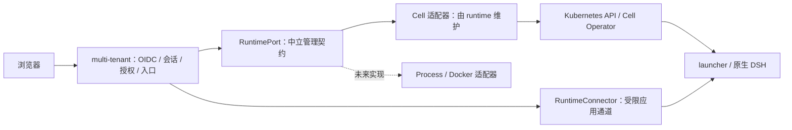

# S0：平台与运行时契约设计

状态：**Proposed / 待用户审阅**。2026-09-19。
主需求：[Issue #82](https://github.com/GuoMonth/dsh-multi-tenant/issues/82)。本稿只交付设计，不意味着 S0 已获批准或 S1 已开始。

## 阅读入口与结论

建议先审阅本文件第 1–4 节及第 10 节。规范细节见运行时仓库的 [中立契约](https://github.com/GuoMonth/dsh-isolated-runtime/blob/80159e9d36f522453b645a16efc0c0d0e3c0078f/docs/design/runtime-contract-v1alpha1.zh-CN.md)，实现映射见 [Cell 映射](https://github.com/GuoMonth/dsh-isolated-runtime/blob/80159e9d36f522453b645a16efc0c0d0e3c0078f/docs/design/cell-binding-v1alpha1.zh-CN.md)。调研取舍见 [参考设计](s0-references.zh-CN.md)。跨仓库文件由本工作区同名目录打开；它们是提案，尚未成为发布 API。

**建议：multi-tenant 是身份与访问协议层；isolated-runtime 是环境资源的权威及契约提供方。平台依赖中立运行时端口，Cell、未来 Process/Docker 实现这个端口。DSH 是被承载的应用。**

这次定义可移植的行为，不先实现所有后端。不把 Cell 对象翻译成一套名字不同但仍然包含 namespace/Pod/PVC 的公共 API，也不为了“协议”新增服务、数据库或消息队列。

## 1. 五条原则

1. **按权威划界。** 谁能使用环境由平台决定；环境实际存在、能否访问、writer 是否停止由运行时决定；Session/工具执行是否结束由 DSH 决定。三者互不代答。
2. **稳定语义先于接口形状。** `retire` 必须在每个后端都表示永久退役该实例、停止其执行并保留托管持久数据，不能在 Process 中只解除引用、Docker 中删卷、Cell 中发完 DELETE 就返回完成。
3. **身份不可复用，位置可以变化。** 平台环境、运行实例和承载进程不是同一个对象。Pod 重建不产生新用户环境；删除重建绝不能继承旧实例的操作权限。
4. **描述需求，隐藏机制。** 上层选择获准的不可变模板；不传 PID、PodSpec、镜像、宿主机路径、端口或任意启动命令。适配器管理物理差异。
5. **MVP 保留正确性，暂缓可用性工程。** 单进程平台、允许断线和重新登录、允许人工排障；不能为了简单而错绑身份、误删数据或把请求超时解释为资源已释放。

## 2. 三个面，而不是一个万能 API



| 面 | 权威/拥有者 | 数据与行为 | 明确排除 |
| --- | --- | --- | --- |
| 平台协议面 | multi-tenant | OIDC、成员、会话、环境 CRUD 的用户语义、模板使用权限、访问准入与连接撤销 | Kubernetes 对象、进程回收、存储 fencing |
| 运行时管理面 | isolated-runtime 契约 + 选定适配器 | 创建/读取/退役、不可变归属、实际状态、模板实现与入口绑定 | OIDC issuer/subject、邮箱、用户组、平台角色 |
| 应用数据面 | 平台准入 + runtime 通道 + DSH | 已授权请求经精确实例通道，HTTP/WS/stream/Fetch 透明传输 | 重新实现 chat、Session、exec、文件管理或 MCP 协议 |

“下层不知道 OIDC”不等于“下层没有访问控制”：下层约束管理调用方及其 scope，保护运行资源；平台识别具体用户并判断其是否可访问具体环境。平台及同进程 runtime adapter 是可信控制面，不能声称其中一方失陷后另一方仍能阻止该进程滥用已有服务权限。

## 3. 关键对象及生命周期

### 3.1 平台保留两个概念

- `Principal`：由 `(issuer, subject)` 映射到内部稳定身份；成员关系由可信配置提供。
- `Environment`：产品里的用户环境。首期 `(tenantId, principalId)` 唯一；保存 `environmentId`、授权状态、当前运行时绑定。以后允许一人多个环境时只改平台产品规则。

### 3.2 中立运行时只认识一个资源

`RuntimeInstance` 是一次分配的环境执行/持久数据边界，可能经历多次进程或 Pod 重建。它不是 PID，也不是一次模型执行。

- `runtimeId`：安装实例的稳定标识，由管理员配置；不是 `cell/docker/process` 类型枚举。
- `scopeId`：运行时管理范围的 opaque ID；Cell 实现映射到 namespace，映射一经使用不可悄悄改指另一 namespace。
- `instanceKey`：平台在首次创建前持久生成的随机 UUID；是创建去重键，一次分配永不复用。
- `incarnation`：提供方产生的 opaque 身份；Cell 可使用 UID，调用方不解析其格式。
- `templateRef`：不可变模板名与修订，绑定具体 DSH、构建产物、profile 和部署策略。

`Environment → InstanceRef` 是平台绑定；`RuntimeInstance → Pod/容器/进程/卷` 是运行时内部绑定。进程重启不改变 InstanceRef；换后端或新建替代环境产生新 InstanceRef，绝不隐式迁移旧卷。

### 3.3 首版四个操作

| 操作 | 用户可理解的作用 | 核心承诺 |
| --- | --- | --- |
| `create` | 为已授权环境分配运行实例 | 同 key、同意图返回同资源；冲突不接管；接受不等于 Ready |
| `get` | 查看当前事实 | fresh 状态或明确错误；不从缓存声称资源已释放 |
| `retire` | 管理员永久退役实例 | 先拒绝新访问，确认停止执行后完成；持久数据保留；不可反向激活 |
| `resolveAccess` | 为入口建立精确目标绑定 | 只对当前 Ready 实例，返回绑定而非万能 URL/浏览器令牌 |

`disconnect` 只是释放平台连接/观察器，不是运行时操作。平台重启、登出、撤权不调用 `retire`。

首版不提供 `start/stop/pause/resume/recover/exec/snapshot`。后续能力用有明确语义的扩展接口添加，不能在 `stop()` 名下混用冻结内存、退出进程、删除资源。普通 Process 不满足云端受控模板时，应拒绝该模板，而不是冒充 Cell 同等隔离。

### 3.4 一个必须明确的成本：退役记录

仅有“确定性名称 + Kubernetes DELETE”不能保证删除后迟到的 create 重试不复活资源。因此建议 **首期退役保留很小的终态元数据**，不自动清除实例身份记录。Cell 映射建议保留 CR，收敛到 `Retired`，不保留运行 Pod/入口；托管持久卷保留。未来本地后端可用其本地记录表示同一终态。

这是一个终态记录，不是任务队列或恢复引擎。它避免额外操作 ID/幂等请求表，但代价是下层需要单调退役意图和清理分支；此项属于本次核心审阅决定。管理员移除终态记录属于脱离正常协议的维护行为，不能继续承诺无限期重试去重。

## 4. 中立协议不要求新增网络服务

运行时项目维护三层：

1. **语义规范**：纯数据对象、操作前后条件、错误/重试、符合性案例。与语言/传输无关。
2. **语言绑定**：首期 TypeScript 接口与 Node 通道绑定；不把 Promise、AbortSignal、socket 或 Cookie 当成公共线协议字段。
3. **Cell 适配器**：把中立意图映射成 Kubernetes 调用，Kubernetes 是首期管理传输与实际状态存储。

首期 adapter 随平台进程运行，源码归 runtime 仓库，平台通过显式依赖组合。这样无需部署 runtime daemon，也不让平台业务直接依赖 Kubernetes SDK。

建议未来目录（本稿不创建实现包、不发布）：

```text
isolated-runtime/
  docs/design/                    中立规范与 Cell 映射
  packages/runtime-contract/      后续实现纯 TS 类型/错误/符合性 fixture
  packages/runtime-cell/          后续实现 K8s 适配器及 Node connector
  api/, internal/controller/      现有 Operator
multi-tenant/
  .../application/                Environment 服务，只依赖 RuntimePort
  .../oidc/, .../ingress/          用户身份与入口
  examples/...                    组合具体 runtime-cell
```

业务层不得 import Kubernetes 类型或判断 `backend === 'cell'`；具体 provider 在组合根注入。SDK 是可复用的核心，示例宿主提供配置、SQLite 与最小页面，不把多租户项目改成不可嵌入的庞大 SaaS。

**修正前一版计划措辞：**“直接用 Cell API”仅指适配器的首期实现，不表示 Cell CRD 是跨后端公共契约。当前不需要另写 OpenAPI 服务；未来 HTTP 绑定只传规范中的数据，不改变行为。

## 5. 访问与 OIDC：一个权威、两层检查

### 5.1 平台权限不下沉成 OIDC Token

管理调用使用安装级服务身份；用户的 IdP token、refresh token、Cookie 绝不传进 Cell。运行时保存 `ownerRef=environmentId` 作为不可变归属标记，不解释它代表哪个人。

每次 HTTP、WS upgrade、stream 建连都执行：平台会话 → 成员/环境授权 → 当前 InstanceRef → 可信 Connector。任何浏览器传来的 scope、endpoint、模板或 UID 都不能直接构成可信目标。平台必须在异步解析前登记撤权 signal，并在 dial/转发前重查 signal，避免授权期间的撤权漏掉新连接。

适配器检查管理 scope、实例身份、模板与入口资源归属；launcher/网络执行绑定。`bindingId` 是引用，不是 bearer capability；泄漏引用不能通过公网直达 Cell。

### 5.2 MVP 集成访问模式

- TLS Gateway 把平台域名和受控实例域名都送到 multi-tenant 入口。
- Cell 集成模式不产生绕过平台的公网 HTTPRoute；原 standalone OIDC/RBAC 模式在另一明确配置中保留。
- runtime-cell 从 Kubernetes 验证精确 Cell、Service owner 和目标身份，通过受限集群通道连接 launcher。网络策略只允许管理员控制的入口 namespace/pod；租户不能修改该策略或伪造入口工作负载。
- launcher 增加集成目标检查（实例 UID 和 authority），不能仅凭浏览器 header 认证；该 header 只有在受限入口链内由 connector 重建才有意义。
- 这是可信集群网络方案，不是 mTLS、零信任 mesh 或防集群管理员的保证。不要求首版自建凭据签发服务；S1 必须验证 CNI 确实隔离，失败则拒绝启用该部署配置。

### 5.3 Cookie 与独立 origin

每个实例独立 HTTPS origin，避免不同用户环境共享 browser storage/service worker。origin 由部署策略及 runtime 绑定确定，上层只核对与登记，不自行推导 Cell UID 或端口。禁止任意 return URL 和 iframe 共享身份技巧。

平台 Cookie 用 `__Host-`、Secure、HttpOnly、host-only、显式 SameSite；不能设置全父域 Cookie 让它暴露给任意环境。DSH Cookie 属于 DSH；旧 Docker provider 的内部 Cookie 注入不作为新契约要求。

跨 origin 登录采用一个小的上层 handoff（S2）：

1. 环境 origin 的保留平台路径创建 60 秒随机 nonce，并设置仅该 host 的 Secure/HttpOnly/SameSite=None 临时 cookie（允许固定平台 origin 的 POST 回调；不同站点部署需在 S2 验证浏览器策略），跳转固定平台登录入口。
2. 平台通过 OIDC Code+PKCE、state/nonce 建立会话；确认环境授权后签发内存中一次性 code，绑定当前平台会话、确切 origin/InstanceRef 和 nonce。
3. 通过 POST form 将 code 送到已登记环境 origin 的保留回调路径；禁止把 code 写 URL、Referer 或日志。
4. 回调原子消费 code，校验 nonce cookie、目标和会话仍有效，签发 host-only 环境会话并清理 nonce。回调仅接受确切平台 Origin；请求频率/条目数有界。

保留路径建议 `/_dsh_platform/`，由平台截获不转发 DSH；S1 核对与精确 DSH 路由不冲突。handoff 页设置 no-store、no-referrer、严格 CSP。其设计用于避免父域 Cookie，不是新 IdP 或新运行时鉴权协议。

进入普通 DSH 请求后，平台剥离自己全部凭据及外来转发/身份头；仅让 DSH cookie 通过。响应不能覆盖平台保留 Cookie 或设置越过实例 host 的 Domain Cookie。S1 验证完整原生 transport，不重新实现其 payload。

### 5.4 会话与撤权承诺

首期单平台实例，内存会话默认最长 1 小时（可缩短、无静默无限续期），重启全部失效。平台 logout/管理员撤权操作完成前，标记会话不可用并关闭其本进程持有的 HTTP/WS/stream 连接；到期定时器做同样处理。

管理员静态成员配置变更可先通过受控重启生效，重启撤销所有会话；无需首期动态目录同步。IdP 外部禁用不承诺即时传播，最晚在平台会话到期后重新认证时体现。断开代理连接不等于终止 DSH 已在后台执行的任务；本期撤权只承诺访问撤销。运行终止是独立管理员退役动作。

## 6. 状态、存储与最少持久化

平台只保存稳定身份映射、成员/授权、Environment 与 InstanceKey/InstanceRef、固定模板选择。绑定首次创建前提交 SQLite；禁止先创建后才生成幂等 key。

运行时保存自身资源与终态，平台不持久化第二份 Pod 状态。状态缓存用于页面显示，访问准入须重新检查；平台重启后 `get` 重读，不能把原 coordinator 的 unresolved 自动恢复流程搬到 Cell 上。

MVP 一份平台 SQLite 持久卷、单活进程即可，不加 Redis/分布式锁。数据丢失不是本期自动灾难恢复场景：不能通过扫描所有 Cell 自动认领；人工核验原身份绑定。已有 Docker 状态库不自动迁移为 Cell 状态，也不清除旧数据。

退役默认保留所有由该实例托管的持久数据（包括必要 private-state），不承诺内存、临时目录、外部 Secret 或 CSI 灾备。新增集成模板需显式让 private-state 同样保留；现有 standalone 删除行为不因该提案静默改变。保留不等于新实例可以重新挂载；首期无自动导入/恢复入口。

## 7. 未来后端需要满足什么

| 语义 | Cell 首期 | Docker 将来 | Process 将来 |
| --- | --- | --- | --- |
| 资源身份 | Cell UID，Pod 更换不变 | runtime 记录 ID，容器 ID 为内部子资源 | runtime 记录 ID，PID 为内部子资源 |
| 创建/终态去重 | 同一 Cell 记录，Retired 留存 | 本地持久记录 + 容器 ownership | 本地持久记录 + 可核验进程归属 |
| Ready | 原生应用就绪及绑定可用 | 同样的应用就绪 | 同样的应用就绪 |
| 平台断开 | Cell 继续运行 | runtime 保有资源 ownership | 需独立 supervisor 或明确管理进程生命周期，不能父进程退出就误称仍可用 |
| 退役完成 | 确认旧 owned writer 消失 | 确认容器及其执行停止 | 确认整个 owned 进程树停止，防 PID 复用 |
| 模板/隔离 | 已验证的集群策略 | 已验证挂载/网络/权限约束 | 只提供能真实满足的可信开发模板 |

不承诺相同模板跨后端可用或存储可迁移。不同 provider 的资源位置、安全边界与可用性可以不同；核心操作的后置条件不能不同。Process 没有足够隔离时返回 UnsupportedTemplate，不能静默降级。

## 8. 社区经验如何落地

OpenSandbox 的生命周期/执行分面适合借鉴，但 DSH 已有应用协议，我们不复制其 exec/filesystem API。Agent Sandbox 说明 stateful singleton 可以建立在 Kubernetes 原生资源上，不需要另起调度系统。containerd 的 Controller 抽象说明公共 lifecycle 可以隐藏具体承载；它的底层 PID/OCI 细节不适合作为我们的应用契约。E2B 的 pause 包含特定持久化语义，提醒我们不能把各后端的“停一下”都叫同一种暂停。

具体来源、固定源码 commit 和不采用项见 [参考设计](s0-references.zh-CN.md)。这些是参考，不声称我们兼容任何上述协议，也不要求换掉现有 Cell Operator。

## 9. 实现与符合性验收

S0 交付三件事：本架构决策、runtime 中立规范、Cell 映射；附符合性案例供用户审阅。用户批准后再写 runtime-contract/runtime-cell 包及业务接入。

顺序：S1 只接预建实例和访问链；S2 OIDC；S3 创建读取；S4 退役和数据边界。S1 可先覆盖 `get/resolveAccess`，不能因此宣布整个 v1alpha1 conformant。单一实例观察可以用有界重读，不强制 watch 服务。

每个后端以后必须过相同规范案例，再加自己的 ownership/隔离验证。mock 仅证明平台不依赖 K8s，不能证明真实后端隔离或原生 Web 可用。

本次未修改业务代码，未执行浏览器、集群或真实模型验证。现有代码证据固定在 multi-tenant `c236331ea3da315d7c83e392df535fa07ba51ecb` 与 runtime `4153dd468e34b5f73ccf576323519d81b6e10549`。

## 10. 请优先审阅的决策

1. **契约归属与依赖方向**：runtime 维护中立契约及 Cell 适配器；multi-tenant 只消费，提供用户协议/OIDC 与组合入口。
2. **核心操作大小**：create/get/retire/resolveAccess，首期不加入暂停、执行、快照和可移植存储。
3. **退役而非无痕删除**：保留实例终态和数据；Cell 增加单调退役状态，换取明确的迟到重试语义。
4. **访问边界**：平台独立 origin/host-only 会话 + runtime 受限连接；无直接浏览器 runtime capability，无双重 OIDC。
5. **MVP 成本上限**：单上层实例、进程内适配、无 runtime 服务/操作引擎；保留最少持久记录，不追求 HA 和无感恢复。

最大的实现不确定性是 Cell 集成访问链（authority/cookie/路由）和退役时对旧 writer 的实际观测。设计明确了后置条件，S1/S4 必须用真实环境证明，不能以文档推演代替。
