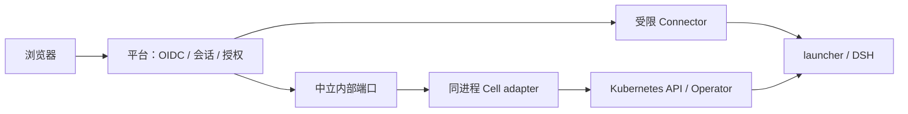

# S0：Cell MVP 与中立内部契约

2026-09-20 修订。原则已由用户确认，见 [项目宪法](../../CONSTITUTION.md)；本文件记录技术契约；固定版本已完成联调，实际证据见主 Issue。下一阶段收缩以 [POC 边界](poc-focus.zh-CN.md) 为准，不把历史备选方案扩成当前范围。主记录：[Issue #82](https://github.com/GuoMonth/dsh-multi-tenant/issues/82)。

本稿替代 2026-09-19 的通用 runtime v1alpha1 草案：不再承诺跨后端兼容、永久退役记录或历史恢复。社区调研仍见 [参考与取舍](s0-references.zh-CN.md)。

## 1. 权威与依赖方向

| 层 | 负责 | 不负责 |
| --- | --- | --- |
| multi-tenant | OIDC、成员/环境授权、平台及派生会话、用户 API、原生请求准入 | Kubernetes 资源生命周期、卷复用判断 |
| isolated-runtime | 当前 Cell 适配、实例身份与状态、资源生命周期、受限连接 | 用户 OIDC、产品角色、DSH Session 协议 |
| 原生 DSH | Web、Session、workspace、工具及应用持久化 | 平台身份和集群控制 |

内部端口归 runtime 维护；平台通过组合根接入，业务层不导入 K8s 类型或判断 backend。当前一个实现足够，不先拆多个发行包、另起 runtime 服务或冻结 JSON/HTTP 线协议。未来 Process/Docker 需真实场景和第二份验证后再提炼共同语义；本期没有它们的兼容验收表。

## 2. 最小对象与操作

平台 Environment 保存 `(tenantId, principalId)`、稳定环境 ID、当前分配 key、获准模板和实例绑定。分配 key 在第一次写请求前持久保存；它与具体实例 identity 分开。身份由 runtime 颁发并按 opaque 值比较，平台不解析 Cell UID。

当前内部端口只需创建、读取、请求删除和取得受限连接句柄。删除返回“已接受”不代表 writer 已停止；记录缺失不等于安全释放。用户登出、撤权和平台退出只关闭平台连接，不能调用删除。

模板固定精确 DSH/image/profile；runtime 在允许访问前验证实际资源与模板一致，返回的是已验证身份，而非意图回显。失败返回结构化诊断，不让平台重新实现一套产物校验器。

详细语义由 runtime 的 `docs/design/runtime-port.zh-CN.md` 与 `cell-adapter.zh-CN.md` 维护；它们是内部设计，可随验证结果破坏性修改。

## 3. 有界创建与失败

- 资源存在期间，同一 key/同意图返回当前资源；不同归属/模板拒绝接管。
- 配置/权限/版本不匹配立即失败。就绪等待有截止时间，超时返回当前状态或写结果未知。
- 未知结果只查询原 key，不自动换 key、后台无限重试或删除状态。
- 已知实例记录消失时，拒绝自动 recreate；需要明确的新分配及新数据边界。旧分配不能作为新实例授权。
- 创建仍在途或结果未知时，平台拒绝对该分配自动执行删除/重建；管理员明确处置后不得重放旧请求。
- 删除/重置/版本更换后不支持旧请求无期限重放；无需永久 tombstone 或 Cell Retired 状态机。

这不是 exactly-once 系统：违反调用顺序、管理员带外清空记录后重放旧 create，不在当前保证内。该边界必须在入口拒绝/操作说明中显式体现，不能暗中宣称覆盖。

## 4. OIDC 与访问

OIDC 用成熟客户端完成 Code+PKCE、state/nonce、精确 redirect 校验，以 `(issuer, subject)` 映射用户，可信配置映射成员。单上层实例、内存会话、重启重新登录即可。

环境会话必须作为父平台会话的派生句柄，寿命不超过父会话。撤权先使父子句柄不可准入，再关闭其已持有连接；异步访问解析前登记失效 signal，转发前复查，防止撤权与新连接竞态。关闭访问不承诺停止 DSH 后台任务。

每个环境独立 HTTPS origin，平台及 DSH cookie 不混用，不用父域 Cookie 跨所有用户环境共享权限。每次 HTTP/WS/stream/Fetch 准入验证会话、Environment 与精确实例；清除平台凭据及外来身份/转发头，原生 payload 保持透明。

**登录落地只安排一次有限验证**：固定两个 origin，使用成熟 RP 的固定回调，验证 host-only 会话与 nonce/state 传递；确需 handoff 才设计一次性、目标绑定、原子消费的交换。先声明 same-site 拓扑再选择 Cookie 属性，暂不支持任意跨站部署。S0 不冻结自制 handoff、HMAC cookie 或跨域身份服务。该验证归 S1/S2，不再扩大为抽象协议研究。

Cell 集成入口复用现有 Gateway/TLS，所有用户访问经过平台，runtime 只允许受控入口连接精确目标。发现旧 standalone 直达路由或模式冲突时拒绝启用，不自动删除其资源或热迁移。具体 UID/Service/launcher 校验在 adapter 内，浏览器不能提供 endpoint。

## 5. Fast fail 诊断

错误含稳定 code、stage、脱敏 target、observedState、effect（not-submitted/accepted/unknown）、retry（never/read-first/same-request）、nextAction、correlationId。当前构建内语义稳定，不承诺历史格式兼容。

nextAction 给可理解的具体检查，例如“用原实例标识查询创建结果”“核对配置中的模板修订”；不包含凭据、不执行 AI 提议的命令。预期就绪是 Pending，不报泛化失败；等待到期立即交还诊断，不启动自动修复。

示例与 Cell 错误映射见 runtime 内部端口文档。上层可精简用户显示，但必须保留错误码和诊断关联信息供 AI/管理员定位。

## 6. 版本、数据与退出边界

首期固定 DSH 0.1.5-rc.2 / fb2c4b9e698e30edb738bca4cf0618587db7d203，并记录匹配的双仓库提交和镜像。后续迭代可直接破坏接口/配置/状态格式，不维护旧 provider/CLI/状态的兼容层；旧发行物保持历史事实，不是新版本义务。

平台仅保留当前环境/授权/绑定等必要事实，不另存 Pod 生命周期。状态格式不匹配 fail fast；可以明确新建测试数据目录，但不自动抹除旧目录。正常 Pod 重建的数据保留仍是当前 Cell 验收，不承诺历史数据在新版本可用。

管理员删除按确切实例和当前模板的保留策略执行；data/private-state/外部 Secret 的处置范围要分别说明，不能为保留数据暗中永久保留所有凭据。数据销毁采用明确授权、精确资源和可重试操作说明；本期不加 purge/升级/迁移 API。

## 7. 开发与验收顺序

1. S1：预建 Cell、固定测试身份，验证真实原生 HTTP/WS/stream/Fetch、精确入口和绕过拒绝。
2. S2：成熟 OIDC 接入、两个身份、派生会话与新旧连接撤权。
3. S3：幂等创建/读取、有限等待、AI 可解读错误，平台重启重新登录到仍存在的原 Cell。
4. S4：当前实例的 UID 条件删除请求、数据处置说明、正常 Pod 重建后文件/会话保留、真实模型调用。

只测当前版本组合。文档不等于运行证据；mock 不证明隔离。范围已明确，不以未来后端、恢复能力或全面历史矩阵拖慢首条闭环。
