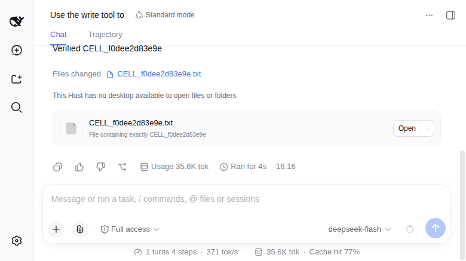

# Cell MVP 内测候选 — 2026-09-22

结论：**普通 Pod + runtime 固定模板的首个内测闭环通过**。未创建校准 Cell、未采集 Pod spec 作为平台配置。两个用户使用原生 DSH，真实模型与 Bash 子进程可工作；入口撤权、当前版本数据保留和参考部署的网络边界已验证。本记录是本地候选验收，不是新 npm/GHCR 发行，也不承诺历史兼容、HA 或恢复。

## 精确组合

| 项目 | 实际验证身份 |
| --- | --- |
| 平台源码 | `2c31242599f638d9db0aa7780764a9003c22997a`；与合并提交 `42b38e981f4be559a38d884101209698ac42eb1f` 的文件树相同（PR102） |
| runtime / Connector 源码 | `ed914317e98a93752e8af4f7831c384fc1e92f13`（PR95，包含 P1 PR93） |
| 平台候选 | `dsh-multi-tenant-0.10.0-alpha.1.tgz`，SHA-256 `5bf6fe6e60d2c01ff97546e942c9ba01529557367187ebde81d992b0a00eae5f` |
| Connector tarball | SHA-256 `e9aaa0a364cd6277ea7038025e5ffb8a8613c4eebdbe0c424c56721d162ace10` |
| DSH | `0.1.5-rc.2` / `fb2c4b9e698e30edb738bca4cf0618587db7d203` |
| Cell 候选镜像 | `localhost:30482/dsh-cell@sha256:c9462f224229cb54295d5dfee8bb7f44a26285e1efda341800b7831592f6941e` |
| Operator 候选镜像 | `localhost:30482/dsh-operator@sha256:e285736e74aa00342402fc2b6a0f0059bdc3a17ddb33c84fafb4e3e8633ac8c1` |
| 平台候选镜像 | `localhost:30482/dsh-platform@sha256:f80d119ce58260c5e09127dff06b4f63ada3404b9af1ee0fcac7aac8294b9d90` |
| 参考环境 | Linux/amd64，Kubernetes 1.37.0，Calico，单平台实例，Node 24，既有 OIDC/Gateway/TLS/StorageClass |

这些镜像引用只在任务 registry 可用，不是其他开发者可直接拉取的公开地址。`cell-release.json` 保持 `source-candidate` 和未绑定公开镜像；当时公开的 npm 组合仍为平台 0.9.0-alpha.1 / runtime 0.3.0-alpha.1，不能用于新模板配置。下一发行需要单独完成公开镜像与 npm 绑定，不能重发旧版本或把这里的本地地址当作发布证据。

## 安装与实际操作

管理员已有集群、IdP 两个测试 subject、DNS/TLS 与存储。按[候选指南](../reference/cell-mvp-v1-candidate.zh-CN.md)从精确 runtime checkout 渲染 `config/platform`，绑定本次镜像；平台 tarball 经干净 consumer 安装检查，再由 `integration/distribution/Dockerfile` 安装同一 tarball 运行。平台使用新的 SQLite/PVC 与两个新的租户 namespace；配置从公开候选示例填写必要参数，仅复用管理员提供的身份/证书前提，没有复制旧 profile、旧平台数据库或应用数据。

顺序：安装 Operator → 新平台/namespace/RBAC → 两身份创建/查询 → 原生 RPC/WS → 原生 UI 配模型与 workspace → 模型文件/附件 → Bash 子进程与刷新 → 撤权/非法请求 → 网络策略 → 正常 Pod 替换 → 策略生效后再次真实模型 Bash → 精确删除 Bob 测试 Cell → 同版本平台正常重启。双用户开始到这组集中验收约 20 分钟（按任务日志时间估计，含脚本与本机 DNS 排障），不含先前构建/审查或管理员准备，也不是部署时长承诺。

由维护者在干净 consumer 和新状态下执行；未声称已经由另一个人独立完成部署。可执行流程在[回归指南](../../integration/regression/README.md)。旧 Cell 与旧平台数据保留，Bob 本轮测试 Cell 删除后只保留其 Retain 数据卷。

## 结果

| 边界 | 证据与结果 |
| --- | --- |
| 无校准固定模板 | 生成模板的 server-side dry-run 与实际 API 默认化一致；真实 Cell/StatefulSet/Pod 的完整字段及 UID/owner 链通过 Connector。旧 profiles/expected spec 被拒绝 |
| 两身份与原生协议 | 真实 Alice/Bob OIDC 登录、分别显式创建/查询、独立 Cell；跨 owner API 拒绝；HTTP RPC、24 路并发、WS snapshot、HEAD/GET export、会话隔离通过 |
| 真实模型 | `deepseek-flash` 原生 write/read、上传文本处理完成，唯一标记 `CELL_f0dee2d83e9e`；凭据仅在私有 DSH 设置 |
| Pod 内工作 | 原生 Bash 调用 Node `child_process.spawnSync` 写文件；检查工具卡的实际命令、独立 stdout nonce 和无非零/信号/超时结果。刷新后新的 Bash 调用读回；网络策略和 Pod 替换后再次通过 |
| 撤权与非法访问 | 登出、SIGHUP 移除成员关闭既有 WS，后续 RPC 拒绝，Bob 不受影响；伪造身份头 401，跨 Origin/缺失 Origin 的写请求 403 |
| 普通 Pod 替换 | Alice Pod UID 从 `6952b801-de31-4787-8488-96cbb377837a` 变为 `61585ee9-457d-4ea9-ac91-c5a31d3b0ded`；Cell UID、数据/私有 PVC UID 不变，工作区标记与既有原生 session 可读 |
| 精确删除与正常重启 | 公共删除 405，错 UID 拒绝；精确私有管理删除先撤权，重复 DELETE/POST 不重新分配。实际 Bob Pod/私有 PVC 消失，Retain 数据 PVC 留存。平台同版本正常重启后 Alice 绑定/会话保留，Bob 删除屏障仍在；API 的 accepted 仍不等于已证明 writer 停止 |
| 有限代理 socket | runtime 18 项 Connector 测试含首部等待、迟到 Upgrade、HTTP/WS 长流与取消；平台 3 项真实 socket 检查包含凭据清洗、校验中撤权，以及 Linux TCP accept queue 饱和时连接按100ms测试阈值有界失败（实测90–1000ms断言，排除立即拒绝并早于4秒首部阈值） |
| 源码/安装检查 | 完整 `pnpm release:check` 通过：40 个包测试、10 个平台测试、7 个脚本检查，构建/类型/契约、SQLite 与已安装 tarball smoke；这些本地检查与真实集群证据分别记录 |

## 参考网络的实际边界

runtime 自动提供 Cell ingress；管理员另施加 egress-only 策略。可信 probe 能连接平台、Dex 和 Kubernetes API；两 Cell 到这些地址、对方 Cell 的连接均在 5 秒内超时。实际平台 Pod 能连接两 Cell，无关系统 namespace Pod 不能连接 Cell。Link-local metadata 与其他不可达目标仅作附加观察，不拿它们证明策略成功。

本机透明代理使 Cell 将 `api.deepseek.com` 解析到 benchmark 地址 `198.18.0.171`；公网 A 的直连在本机网络不可用。曾做单域 CoreDNS 试验，最终恢复并核对原配置。最终管理员策略仅开放 CoreDNS TCP/UDP53 与当前模型出口 `198.18.0.171/32:443`，没有开放整个 `198.18/16` 或其他私网。两 Cell 以原 hostname 完成证书校验并得到无凭据 HEAD 401；策略生效后真实模型 Bash 调用也成功。

这是明确记录的本机代理前提，不能泛化为普通公网部署的 allowlist。其他部署按实际模型/DNS/出口填写并验证；地址变化需管理员更新。Pod 本身不自动隔离出站，AI 指令遵循也不替代网络边界。

## 审查与本轮修正

Luna 分担 runtime、平台和验收；主线程整合与实测。Claude Code 的第三方审查使用本机配置的 DeepSeek 后端，不是 Claude 模型。采纳了把 DSH 版本纳入 Go 生成模板的建议；关于 StatefulSet `serviceAccount` 默认字段的疑问由真实 API dry-run 排除，未盲改正确代码。

实际发现并修正的是验收流程：等待编辑器可编辑，展开 Compact turn 与原生 Bash 卡，使用真实 `data-sample` 属性；管理测试调用安装包而非源码 dist；撤权记录不再冒称做过 Pod 重建，Pod 替换由独立脚本执行并核验。没有为通过验证加入迁移、自动恢复、多后端、通用模板或代理框架。

不覆盖其他架构/集群版本、任意 admission webhook、强制删除/分区 fencing、历史升级、HA、灾难恢复、任意依赖安装或全面攻击矩阵。当前支持范围内没有阻塞首个内测闭环的未修问题；公开发布与新环境部署仍各自需要对应证据。
