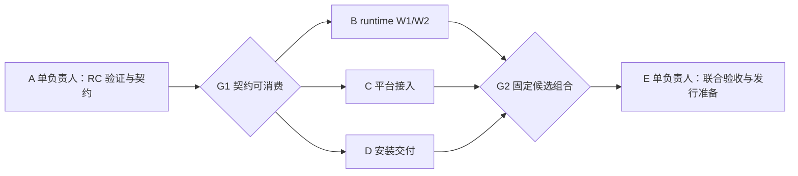

# DSH RC2 MVP 准备与执行计划

2026-09-29 已完成 A–E、真实 DeepSeek/GitHub CLI 联合验收与用户授权的发布。平台 [v0.10.0-alpha.1](https://github.com/GuoMonth/dsh-multi-tenant/releases/tag/v0.10.0-alpha.1) 与 runtime [v0.4.0-alpha.1](https://github.com/GuoMonth/dsh-isolated-runtime/releases/tag/v0.4.0-alpha.1) 已发行；精确组合、测试结果和限制见 [最终验证报告](https://github.com/GuoMonth/dsh-multi-tenant/releases/download/v0.10.0-alpha.1/validation.md)。需求与验收记录为 [平台 #104](https://github.com/GuoMonth/dsh-multi-tenant/issues/104)。下文保留执行计划供追溯，不再代表待执行任务；当前安装入口见 [quickstart](../reference/quickstart.md)。

## 目标与冻结项

开源 Alpha，直接破坏性变更。不维护旧 Cell/Process/Docker 路径、旧 API/配置/状态兼容、升级迁移或旧 Alpha 导出工程。旧版测试只保留仍验证新边界的部分，不跑旧后端矩阵。既有真实数据和其他任务资源不因删旧代码而被自动清理。

- DSH：`0.2.0-rc.2`，commit `639ed015397290b3745d163aafe02ffee4aa3f84`；2026-09-29 npm next 指向该版本，latest 仍是 0.1.7-rc.2。锁精确版本/提交/镜像，不随开发过程追新 RC。
- Kubernetes 唯一产品后端；复用 agent-sandbox core。已有试验基线 `v1.0.3`，manifest SHA256 `725fafdabe6aac202a89dc57f1cfe0e2e92f3164c8c2bd343fffca52f7039d96`，amd64 controller digest `sha256:b2160ee08dd4f2285b382d4b5073948891adfacbc9808a4ba9cf247766243c8c`。A 阶段核验可获得性与兼容性，不无理由改选底座。
- 每用户一个环境、一个独立 PVC；挂载 `/var/lib/dsh/data`，`workspace/` 是工作目录，`home/` 是 HOME，`dsh/` 是 DSH_HOME；可配置的缓存使用临时目录。不为搬动每个上游缓存增加补丁。
- 原生 CPU/Memory requests/limits；一个存储容量参数；少量默认配置和明确错误。不做目录配额、存储 min/max、自动扩容、容量仪表盘和排队服务。
- 单集群、Linux/amd64、平台单副本、已有 OIDC/DNS/TLS/模型入口、一条安装路径。未来大规模、HA、备份灾备和历史升级不阻塞 MVP。

## 基线和准备工作区

准备前远端 main：平台 `74deba5a752cff551bfe812f8a1dcc2a150cf53b`；runtime `8a0fde1dc9ce035f58478b417068b5ecf88b52c7`。准备 PR 已合并；A 实施基线为平台 `96bc9116f38e551670ab6ba8325942acea2390cc` / runtime `497a18ecd3315dfad5bf9b328193a2d2e6d4ffba`。上述准备基线的生产源码当时仍是旧 Cell 和 DSH 0.1.5-rc.2；后续 A 已合并 RC2 契约，B/C 实现按实际候选推进，不将准备文档当成新代码。

复用两个干净、无运行中 Agent 的 Orca `enterprise-positioning` 工作区，由协调者独占准备文档写入：平台 [PR #114](https://github.com/GuoMonth/dsh-multi-tenant/pull/114)，runtime [PR #104](https://github.com/GuoMonth/dsh-isolated-runtime/pull/104)。本轮改为 Alpha MVP 范围，消除双卷/历史迁移/企业门槛冲突；不另开重复规划 PR。准备文档建议平台先、runtime 后；最终合并按用户授权执行。后续实现从协调者确认的精确基线创建工作区，不根据 Orca 父子关系猜测 Git 基线。

## 波次与文件所有权

计划是 1 → 最多 3 → 1 个实现负责人；协调者负责审查、依赖与节奏，不同时抢写 worker 文件。资源紧张或接口尚未稳定时降为 2 路，不能为了并行率绕过 G1/G2。

### A：最新 RC 与契约基线（单负责人，先做）

- 目标：runtime `compat/dsh`、镜像/launcher 兼容层、Connector 产品类型/固定模板；平台 DSH pin 与窄消费契约。映射 runtime #97 与平台 #105，不新建重复需求。
- 变化：用真实 RC 验证启动参数/就绪、HTTP/WS、模型配置、HOME/DSH_HOME/凭据落盘；判断旧 `cell-settings.patch` 是否可删除，优先上游原生发行能力。仅在有复现证据时保留最小补丁，不维护 fork。
- 契约：固定创建、查询、进入、停止/启动、删除运行资源的输入/输出、owner/CR UID/单 PVC UID、正常与未知结果、错误分类、namespace 供应职责和模板来源。最小接口服务本轮，不增加扩展框架。
- 所有权：该阶段串行，可写两个专属 checkout；包版本/锁文件/pin 仅此负责人修改。提供双方提交、Connector tarball integrity、可运行镜像 digest、契约测试和 B/C/D 的路径所有权表。
- G1：真实 RC 原生入口与持久目录 smoke 通过；客户端可导入精确契约，假实现仅用于平台开发；上游 Sandbox 模板可启动 RC 单卷样本。未通过前不启动三路大改。
- 限制：真实模型与工具授权可在 E 最终验收，但基础接入不能只用 mock；不做旧会话 V3/V4 迁移，不重写 DSH 插件/模型协议。

### B：runtime 生产生命周期（并行路一）

- 目标：runtime #97/#98，Go runtime、Connector 实现、单 PVC 固定模板、必要 RBAC 与 runtime 测试。
- 变化：采用上游 core，删除自有 Cell/Operator/STS/snapshot 控制路径与旧后端；实现单卷供应/绑定、查询、显式启停、精确运行资源删除与默认保留数据。W1/W2 同一负责人，避免两个 worker 争改生命周期代码。
- 约束：不改 A 契约，不做二次调谐/新服务/自动恢复；正常停止未证实时拒绝重启或清卷，节点分区不承诺自动恢复。接口缺口用 Orca question 交协调者裁决。
- 验收：相关 Go/Node 测试、生成物与源码检查，真实 kind 的创建/启停/Pod 重建/缺卷/换 UID/并发/撤权连接场景；提供精确 commit、tarball 和镜像。测试 fixture 使用新资源名；旧双卷试验不能冒充新证据。

### C：平台产品入口（并行路二）

- 目标：平台 #105，`packages/multi-tenant`、OIDC/准入/EnvironmentBinding、生命周期入口、根 exports/pack、对应单元和 transport 测试。
- 变化：消费 A 契约，移除旧 RuntimeProvider/多后端入口，原生代理不变；每用户一环境，接入启停/未知结果与归属验证，关闭已撤销的连接。最小 UI/CLI 明确进入、停止及失败状态。
- 所有权：平台源码与 package.json/lock/exports 由 C 独占；不修改 D 的安装 chart/安装测试，不写 runtime 实现。B 未交付前可用契约 fixture开发，但不能据此关闭联合验收。
- 验收：OIDC/跨用户拒绝、并发创建去重、未知结果、访问撤销与启停入口；类型/包构建/干净 consumer smoke。提供精确平台候选，最终使用 B 的真实制品复验。

### D：一条安装路径（并行路三）

- 目标：平台 #111，新增 `charts/`（若 A 裁决沿用其他安装路径则以 G1 所有权表为准）、安装 fixture/预检、最小 values 与安装说明草稿。
- 变化：一个入口部署固定 upstream core/runtime/platform；配置 OIDC、模型、域名/TLS、StorageClass 和默认额度，Secret 使用引用；固定模板按需供应 namespace，不逐用户手工操作。
- 所有权：独立平台 worktree，只写安装目录和安装专用测试；不改 C 的平台入口、包清单/锁文件或 B 的 runtime RBAC/模板。所需接口变更提给其 owner，不复制模板或创建第二实现。
- 验收：Helm lint/template、已批准 RBAC 和默认参数、清晰前提/错误。G2 后在独立安装 namespace 使用真实候选安装；有 mock 或占位 digest 时只能报告阶段完成，不能报告安装通过。
- 限制：不做通用安装器、集群创建产品、Vault、备份系统、离线发行或多平台矩阵。namespace 供应通过 A 固定的最小 runtime 管理契约由平台触发，管理员授予其有限模板权限，用户 Pod 无集群 token。

### E：联合收口（串行，复用可胜任的已结算 worker）

- 目标：平台 #106，消费 B/C/D 的精确提交/镜像/包组合；协调者指定唯一集成负责人，可写两仓库的集成修复与发行文档。
- 顺序：runtime 候选 → 平台固定消费 → 安装消费双方 → 干净参考环境第二操作者 → 双用户/真实模型/工具 → 窄负例与小规模性能 → 发行准备。源码 PR 合并与制品发布分别依照已有授权，不自动推断可发布。
- 验收：OIDC 两真实 subject；每人单卷和原生 HTTP/WS；真实模型读写工作文件及执行命令；至少一个 MCP 或 CLI 真实授权链；退出/撤权拒绝；停止/启动与 Pod 重建保留文件/会话/配置；缺卷/换 UID 拒绝；CPU/Memory 与实际存储边界清楚；另一操作者仅凭文档安装。
- 资源不足先明确失败，不要求队列；正常唤醒记录实测，不强制 5 秒或 5000 在线。完整备份/升级 #112 和规模 #113 不阻塞本轮。
- 版本表记录双仓库 SHA、DSH SHA、upstream controller/workload/platform digest、Connector/平台 npm integrity、集群/CNI/存储与测试结果。未完成真实工具授权时该项保持未验收，不能用 mock 或文档替代。
- G3：上述闭环全部通过、未覆盖边界写清，候选可发行。一次集中验证足够；只有后续修改触及相应风险才重跑。最终失败归还原 owner 修复，不派两个 worker 同时修同一缺陷。

## Orca 协调规则与启动步骤

用户已授权启动，本轮按以下监督顺序执行：

1. `orca-ide status --json`；重读当前版本 `orca-ide skills get orchestration --json`。创建本轮 Run，A 使用独立任务 worktree，读 exact repo/base/host，不复用其他产品终端。
2. 将以上 A–E 作为自包含 task spec：target/change/constraints/ownership/observable acceptance。创建真实依赖 A→B/C/D→E；Task spec 同时引用主 Issue 和本计划的固定提交。模型/effort 默认继承，不擅自指定。
3. 使用 `orca-ide orchestration worker-start` 启动 A；验证启动 receipt，失败按 recovery 指引处理，禁止因无输出重复派发。G1 通过后才启动全部 ready 的 B/C/D，再等待。
4. 每 worker 一可写 worktree；B 独占 runtime 生命周期，C/D 独立平台分支且文件互斥。单一集群写入 owner：B 用本地实验集群做 CRD/runtime；C/D 开发期做离线/单元验证。B 结束后交给 E 安装联合候选，不让 D 并发升级共享 CRD/controller。
5. 等待 `worker_done/question/escalation`，每次等待不超过 60 秒并向用户报告实质进展。处理 delivery 后 ack；接口问题由协调者统一答复并通知所有消费者。
6. worker_done 后验证证据，再复用、保留或 release 终端；不能凭终端安静认定完成。失败/失联不自动重复启动同一编辑者。每波结束记录双方提交与精确下一消费组合。
7. G2 后 E 独占联合环境；必要时一位只读审查者复核边界，修复仍归原 owner。最终统一文档、Issue 验收与制品，不让各路分别声称整个 MVP 完成。

工具台账由本地资源技能管理，Orca 卡片保存即时状态，Issue/PR 保存需求与证据。无需额外通用任务调度平台。

## 本机预检与限制

- 32 逻辑 CPU，约 60 GiB 内存（准备时可用约 53 GiB）、1.6 TiB 剩余磁盘，足够 1→3→1 本地开发和小规模验证。最多两项重型构建同时运行；集群安装/改 CRD 串行。
- Docker 29.8.1、buildx 0.37.1、kind 0.32.0、kubectl 1.36.2、Helm 3.21.3、Node 24.21.0、Go 1.27.1（使用 `dev-run go=1.27 -- ...`）、仓库 pnpm 11.7.0 已核验。home 下 pnpm 默认 11.12.0，仓库按 packageManager 自动选择 11.7.0。
- k9s 原缺失，已安装官方 v0.51.0 到用户目录并核对官方 SHA256；它是人工观察工具，不是执行依赖。
- Playwright 按仓库锁定 1.58.2，匹配 Chromium Headless Shell 145.0.7632.6 已启动并验证页面；安装浏览器时使用 `PLAYWRIGHT_SKIP_BROWSER_GC=1`，避免清理其他项目共享缓存。集群预检结果见 [准备记录](../evidence/mvp-preparation-2026-09-29.md)。
- 专用 kind `dsh-mvp-rc2`、Kubernetes 1.37.0、Calico 3.32.2、local-path。Pod CIDR 10.244.0.0/16，避开本机 Docker kind 网段 192.168.64.0/20。只保证本机功能验证，不证明跨节点可用性或存储硬配额。
- 集群资源登记为 `dsh-mvp-rc2-kind-control-plane`。私有 kubeconfig 在 `/home/aigs/projects/runtime/dsh-mvp-rc2/private/kubeconfig`；证据在相邻 `evidence/`，机密不进入仓库/PR。
- 后续需要测试 OIDC 两账号、TLS/DNS、模型和外部工具授权。部署配置与临时测试身份由 A/D/E 构造；不将 fixture IdP 当真实企业 SSO 兼容证明。复用已有授权凭据时仅私有文件注入，不打印；若目标工具没有授权或需人工登录，明确提出具体缺项。准备阶段不以其替代真实业务验收。
- 不需要生产 Kubernetes、RustFS/MinIO 或新备份平台。旧 `dsh-issue82` 集群已按用户后续明确要求删除并释放登记，只保留本轮 `dsh-mvp-rc2`；不清理其他项目资源。本轮无 root 权限缺口；后续若系统依赖需要权限再报告实际错误。

## A 阶段实际交付（2026-09-29）

官方 npm RC2 精确锁定；runtime 删除旧源码重构建配方，用 npm 发行模块前后 SHA256 限定的一行 settings 补丁解决真实远程 hostname Models 不可用。原生 workspace-controller documentsDirectory 配置解决无桌面环境默认工作区查找。

新包 `@dsh/environment-connector-internal@0.0.0-rc.2` 提供窄类型及可执行单 PVC 模板，平台以 vendor 精确 tarball 消费并完成导入/类型检查；该包尚无生产 lifecycle factory。B 固定实现 `createAgentEnvironmentRuntime(options: EnvironmentRuntimeOptions)`；配置和语义见 runtime `docs/design/environment-contract.zh-CN.md`。

真实验证及制品身份见 [A 阶段证据](../evidence/mvp-a-rc2-2026-09-29.md)。完整生产启停/负例由 B 实现验证；平台 OIDC/模型/真实外部工具及安装联合验收由 C/D/E 收口。已有旧 Cell 导出仅为后续删除的中间状态，不作为兼容模式。

精确文件所有权：B 独占 runtime（含模板/RBAC/Connector/launcher/image）；C 独占平台 packages、scripts、vendor、根 package/lock 和非安装 integration；D 仅 charts、integration/installation、docs/installation。A 后的包/锁/pin 由各仓库实现 owner 独占；D 不复制 runtime 模板、不改包锁。集群唯一写入权按 A→B→E 转移。

## C 平台实现候选（2026-09-29，已消费 B 生产包）

平台已将绑定/OIDC/会话/ingress/管理入口归入正式包，删除 RuntimeProvider/coordinator、多后端、Cell Connector、旧 SDK/体验入口和旧发布门禁。配置仅 runtime、stateFile、adminSocket、oidc、members、host、port；members 映射登录身份，平台自动按 owner 预留唯一环境，不再维护逐用户 environments 清单。

绑定保存完整 owner/allocationKey/Sandbox UID/单 PVC UID、创建/启停未知屏障及删除屏障；Ready 才发布访问，停止与撤权关闭连接，缺失或换 UID 拒绝，删除后查询缺失仍保留具体诊断而非声称停止/删除证据。CLI 提供平台 start 及环境 inspect/stop/resume/delete，容器 UID/GID 1000，GET /healthz 仅本地 readiness。

本地类型、平台单元/真实 socket transport、OIDC 签名回调正负例、构建和干净 tarball consumer 已通过；具体命令/数量以 C PR 报告为准。生命周期测试使用明确契约 fixture，不能算联合验收；现固定 B 生产 Connector 来源 `286a68d3ae592fc1ab6193297b79f5fdc9964a3b`，vendor SHA256 `d2d22257c69f1f87e3ca982557530a1133cb7abfa7c94cc9719f84837222224c`，平台静态导入真实 factory 并执行包复验。E 仍负责真实集群、原生 DSH、两用户、模型和工具以及安装闭环；未 npm publish、未推公网镜像、未创建 Release。

## E 联合验证状态（2026-09-29）

B/C/D 已合并，E 作为 D 文档的第二操作者在专用 kind 实际安装并修复两处真实联动缺陷：非 root init 卷根目录 chmod EPERM，以及 HTML no-referrer 导致表单 Origin:null 被 CSRF 拒绝。新增的私有 CA 仅走 Secret 与 Node 原生 CA 信任。精确源码/制品、运行证据和边界见 [联合验证版本表](../installation/joint-validation-2026-09-29.md)。

两个实际 Dex subject 的独立单卷、原生 HTTP/WS、跨 owner 拒绝、退出/成员撤权、显式启停与 Pod 重建持久化均通过；未改变的 runtime 缺卷/换 UID/未知停止负例明确引用 B 的真实证据。真实模型读写文件/执行命令和至少一条真正授权的外部工具链尚未验收；G3 未通过，不宣称可发行。没有发布 npm、推送公网产品镜像或创建 Release，最终由用户 E2E 后决定发布。
