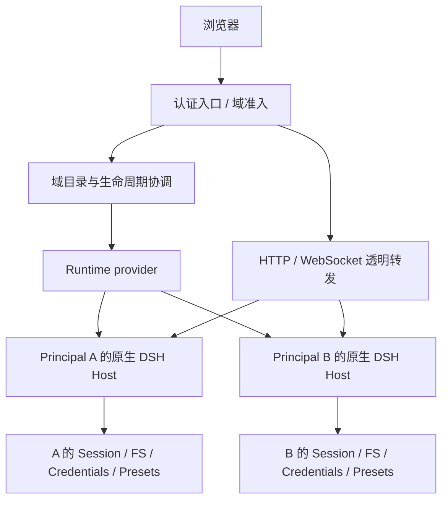

# #68 / #71 重构实施方案

状态：实施中。WP1/WP2 已验证；WP3 的认证入口、原生 HTTP/WS 与官方 Web 联调已通过，WP4 的隔离容器及可验证恢复已通过部分验收。独立根级授权存在实测反例，WP4 完整验收与 WP5 发布替换仍阻塞。产品契约未变更前保留根授权要求。

工作分支：`refactor/68-71-native-authority`。基于 `ffee4840d8e7a79c0065556b8b31f76465708fc4`；DSH 发布验证固定 `0.1.5-rc.2` 与仓库记录的 commit。依据见[架构评估及反向审查](native-domain-refactor-assessment.zh-CN.md)。验证记录见 [WP1](../evidence/native-domain-review/wp1/README.md) 与 [WP2](../evidence/native-domain-review/wp2/README.md)；后续认证入口、容器恢复及根授权反例见 [WP3/WP4 证据](../evidence/native-domain-review/wp34/README.md)，不能将分项通过视为发布完成。

## 1. 交付目标与范围

交付一个可安装、可验证的多租户宿主集成：用户经认证进入自己的原生 DSH Web，使用原生 preset、根/子 Agent、历史、文件与实时控制；其他 Principal 的资源不可访问。

- 初始授权域是 `(tenantId, principalId)`，服务端分配不透明 `domainId`。同一个域拥有多个原生 Session，同租户不同 Principal 不共享宿主。
- 本项目拥有认证接入、域归属、域启动/停止、连接准入与撤销、能力配置和隔离部署契约。
- DSH 拥有域内 preset、Agent lifecycle、continuation、Session 事实/投影、业务 Remote 与官方 UI。
- 允许移除旧 API、旧 SQLite schema、旧示例和旧包内部结构，不实现历史兼容 facade。不把旧数据自动转换到新结构；使用新数据目录，原有数据保持不动。
- 本轮不实现团队共享域、跨域 Session 转移、计费、Kubernetes 调度、多活或任意插件市场管理。
- 根 grant 撤销、Principal 撤销、域暂停是不同语义，不能用 native archive 或 Stop 相互替代。

## 2. 目标结构

入口层使用服务端认证结果选择域，禁止客户端指定后端 URL、进程地址或内部凭据。转发层承载原生协议，不解析并重写业务 Session 响应。官方 Web 的 backend、client graph 和资源必须来自同一固定版本。

先在现有 `packages/multi-tenant` 内建立模块边界，不预先拆成多个发布包。建议目录是实现起点，不要求为了符合目录先搬迁旧函数：

| 模块 | 拟议位置 | 唯一职责 |
| --- | --- | --- |
| 域身份与授权 | `src/domain/` | 从可信 Principal 解析 domain、策略版本和撤销状态 |
| 域持久目录 | `src/domain/repository.ts`、`sqlite.ts` | 唯一归属、域状态及 epoch；不复制 Session 日志和投影 |
| 生命周期协调 | `src/runtime/` | 启动去重、就绪验证、准入失效、关闭、异常回收 |
| 执行 provider | `src/runtime/providers/` | 本地进程验证实现；随后形成受限部署参考实现 |
| 外部入口 | `src/ingress/` | 认证 adapter、域选择、HTTP/WS 绑定、连接撤销 |
| 原生装配 | `profiles/`、`src/native/` | 受支持 dsh profile、域能力与必要的小型插件 |
| 行为证据 | `tests/native/`、`tests/ingress/`、`tests/browser/` | 使用真实 DSH、真实协议、keyless model 和本地 MCP |

域内配置及原生插件不能持有平台域目录、平台管理凭据或 supervisor 控制权限。参考认证 adapter 使用可撤销的测试登录；生产接入由明确的认证协议完成，不扩展成自有用户密码系统。

## 3. 必须先写清的契约

以下是内部语义，具体 TypeScript 命名在首个实际消费者完成后收敛，暂不扩大 public exports。

| 契约 | 内容与约束 |
| --- | --- |
| Principal | 仅可信认证 adapter 产生 tenant/principal；字符串存在或类型 brand 本身不是认证 |
| DomainRecord | 不透明 id、唯一 owner tuple、策略 revision、desired state、持久 epoch；资源路径由受信配置生成 |
| RuntimeSpec | 已解析的版本/profile、域目录、能力引用、执行边界与启动取消；不包含浏览器可直接设置的 shell 命令 |
| RuntimeLease | 内部 endpoint、实际 generation、readiness、退出通知、幂等 stop；不得返回给产品客户端 |
| Admission | 认证会话、domainId、授权 revision、runtime generation、撤销 signal；每个 HTTP 请求与 WS 连接都持有它 |
| Capability configuration | 域级 allowlist、Secret 引用和 revision；preset 只能选择已授权能力，不能扩大权限 |

域生命周期至少区分 `stopped → starting → ready → stopping → stopped`，启动/停止不可收敛时进入 `failed`。授权暂停/撤销保存在独立 desired state 中，进程退出不能意外恢复授权。

每域启动去重；成功 readiness 必须匹配版本、域身份和 generation，端口监听不等于可用。停止先拒绝新准入并关闭旧流，再等待域内工作退出，最后释放资源。超时终止由 provider 处理；旧 owner 未退出前不能交接同一可写数据。

第一版控制入口采用单 active coordinator；本地锁/受限 provider 保证同域单 writer，冲突时拒绝启动。epoch 用于拒绝旧连接，不能冒充操作系统或存储 fencing。多机调度不是本轮假设。

身份撤销、能力轮换与部署更新要失效已有 admission；普通浏览器断线仅释放连接，不立即销毁 Agent/Host。Secret 轮换第一版优先以可验证的域重启完成，不在运行中手工重接多个 MCP/子代理树。启用新 generation 前必须保证旧 generation 失效。

## 4. 实施顺序

每个工作包完成后先进行反向审查，再进入下一包。以下是逻辑提交边界；实际提交、推送及对外沟通仍遵守用户授权约定。

### WP1：原生功能可行性，先覆盖两个 Issue

目的：尽早发现官方完整 Web 与 preset 是否可在域内原样运行，避免先造完 supervisor 才发现入口不兼容。

实施：

1. 新建受控实验 profile，通过受支持的 `dsh` profile 启动固定 rc.2；一个 Principal 一个宿主、数据目录和配置。
2. 使用真实 AgentPresets、Loader、AgentLoop、JSONL、spawn/fork、MCP；测试模型不访问外部服务。
3. 域允许的 MCP 在受管理 preset composition 中注册，保留官方 standing mount 与 toolFilter 语义；不在 `agent/created` 中重绑 scope。
4. 启动完整官方 Web，操作真实会话、子代理、文件和设置；同步确定内层 browser auth、Host/Origin、静态资源和 mux 的实际接入方式。
5. 为两个域建立同名工具、相同测试 Session 标识/路径等冲突样本，证明访问来自域上下文，而非标识恰好不重复。

验收：根/子/孙级能力正确；新建、fork、continuation 冷恢复、blank preset switch 均走原生装配；历史重启可读；两个域的完整 Web 基本路径可用。测试不仅看 schema，也直接调用被拒绝工具。

退出条件：若只能修改私有 binding、复制 continuation/controller 或重做官方 client 才能完成，记录最小失败用例和所需上游 seam，修订方案后再开展后续结构替换。现有 scope-contract-probe 不能替代此工作包。

### WP2：域目录、runtime provider 与可靠生命周期

依赖 WP1 的启动/就绪/退出事实。

实施：域持久目录、唯一 owner tuple、启动去重、最小 runtime provider、readiness、generation、停止/超时清理、异常状态。先实现开发用本地进程 provider，明确它只验证功能和生命周期。

从第一次资源获取开始引入单一 cleanup owner；每步 acquired resource 立即受失败清理保护，成功时只转移一次所有权。聚合业务与清理错误，并对 late acquisition、启动中撤销、停止中启动、controller 崩溃和残留进程加入反例。

验收：并发进入同域只启动一个 Host；另一域不受其失败影响；启动失败不遗留子进程/监听/租约；停止失败不产生双 writer；重启从持久记录重新核对实际 owner，而非把旧 PID 或旧 ready 状态当真。

本工作包吸收 #65 的一般资源所有权问题，但最终关闭 #65 仍需 WP4 的真实 MCP/子代理清理证据。

### WP3：完整原生 Web 的认证入口与撤销

依赖 WP1 的原生传输实验和 WP2 的 RuntimeLease。

实施：

- 认证后解析域；每域优先独立 origin。域选择必须校验 owner，不能仅按 Host header 或 cookie 值索引后端。
- 外层登录状态与 DSH 内层 browser auth 分离。由受信入口建立域专属内部认证材料；具体交接机制采用 WP1 验证过的公开能力，不截取日志猜 token，不绕过原生认证。
- HTTP、GET/HEAD、原始上传下载、WebSocket upgrade 与 mux 后续流绑定同一域及 generation；保持原生 backpressure、取消和错误语义。
- 禁止绕过入口直连 backend；校验外部 Host/Origin 后再做明确的内部 authority 映射。用户伪造的转发身份头和内层 cookie 不得透传成授权依据。
- 在外部身份撤销、域暂停或 generation 更新时取消现存连接与正在传输的响应；重连重新认证。
- 枚举实际 profile 的 HTTP/Fetch/Remote/stream/event-result 入口，锁定审查基线，版本或 profile 增加入口需显式审查。

验收：A 不能通过 B 的 domainId、原生 SessionId、绝对路径、cookie、mux stream id 或审批 event id 接触 B；登出后旧流停止；账号切换、双标签页、断线重连、迟到响应不能混域。浏览器 UI 与直接协议调用均覆盖。

转发不重写 Session JSON，因此不在入口新增第二套 list/search/queue API。全局登录页及域选择可以是本项目 UI，聊天和业务面板保持原生。

### WP4：能力、撤销与执行边界闭环

依赖 WP2/WP3，并在进入公共交付前完成。

实施：

- 独立域的 DSH_HOME、Session/query 数据、workspace、临时上传、Secret 和日志；只读运行时资产可共享。
- 形成一个可复现的受限 Linux 部署 provider，验证执行身份、文件挂载、环境、网络和资源限制；避免平台凭据、管理 socket 或宿主广泛路径进入域。是否采用容器由 WP1/WP2 实测确定，不能只改 isolation 字符串。
- preset/settings/credentials/inventory 的权限由可信 profile 和服务端能力决定。普通用户可使用哪些域内设置明确列出；动态插件和平台管理能力默认不交给域用户。
- 根资源授权撤销先持久化，再阻止新的根/后代 admission，drain 原生工作并拒绝冷恢复。检查原生 list/query/control 对被撤销资源的可见性。若公开 seam 无法覆盖，不把 native archive 替换成授权删除，记录为必须解决的上游集成缺口。
- 以域级能力为初始配置来源；若旧测试要求的 root 级 grant 更窄，保留其不变量，不能扩大为域内能力并集。
- 注入 handle、MCP、Secret、进程 provider 的释放失败与并发 shutdown，检查已尝试释放、残留资源和完整错误链。

验收：跨域 FS/凭据/网络控制边界实际拒绝；根与 Principal 撤销都阻止冷恢复；同一域的其他根是否受影响按明确语义测试；运行态/冷态撤销都可重启验证；#65 反例在新 owner 下通过。

若特定 provider 只证明逻辑隔离，产品及文档按此声明，不能用它通过面向互不信任工作负载的发布验收。

### WP5：替换主线、删除旧实现与交付

依赖 WP1–WP4 的行为验收。

实施：

1. 将 root package、Cordis bundle 和安装文档改为新的域集成入口。原生 Host profile 单独装配，防止控制入口递归启动自身。
2. 删除旧 runtime facade、手工子 scope 接线、私有 subagent 调用、重复 Session 协议和 iframe panel；在同一个逻辑变更中迁移必要测试及 consumer。
3. 重写 package exports、契约校验、SQLite probe、artifact smoke 和 release identity 检查，使其验证新交付，不保留对已删除 API 的假门禁。
4. 提供打包产物消费者的真实双域示例、双语安装/安全/撤销/恢复说明，明确所需认证和 runtime provider。
5. 测量冷/热启动、idle RSS、活跃域与 Session 增长、退出回收、上传峰值和重连开销；将启动 timeout、idle 策略及容量上限做成有测量依据的配置。

不承诺旧目录原地升级或无损降级；默认新建域数据。未来如需要迁移，另定义可验证导入工具，不在本轮恢复兼容层。

## 5. 删除清单与前置证据

| 当前代码/契约 | 替代职责 | 删除条件 |
| --- | --- | --- |
| `runtime-driver.ts` 的 child scope 绑定 | 原生 preset composition | WP1 真实子级与冷恢复通过 |
| `protocols.ts` 的 Agent runtime/child/read/file 协议 | RuntimeLease + 原生 Remote | WP3 正向功能和越权反例通过 |
| `service.ts` 的 `ensureLive`、live Agent map、手工 reader 管理 | 域 lifecycle 与 DSH 原生 lifecycle | WP2/WP4 故障与撤销证据通过 |
| `targets.ts`、自定义历史/文件投影和对应 API | 原生目录、query/projection、files | 同等必要用户行为、归属及撤销验证通过 |
| `tenant_agents_v04` 与旧 repository | 域目录；必要的独立授权事实 | 新唯一性、持久化、single-owner 测试通过；不误删原数据 |
| `web.ts`、starter、scoped-web panel | 认证入口 + 官方完整 Web | WP3 浏览器和原始协议验证通过 |
| 旧 public exports、旧 smoke/assertions | 新安装与 packed consumer 契约 | WP5 打包消费者通过 |

旧测试按授权、行为和资源不变量分类迁移；仅验证已删除实现细节的测试随实现删除。不得以删掉失败测试完成验收。

## 6. 必须交付的测试矩阵

| 类别 | 关键用例 | 运行层级 |
| --- | --- | --- |
| Identity | 同租户异 Principal、异租户同名 Principal、伪造域选择 | 单元 + 入口集成 |
| Composition | 同名 MCP、直接调用拒绝、spawn/fork、冷恢复、preset 切换 | 真实 rc.2 integration |
| Authority | root/Principal revoke、能力轮换、后台重连、重启后拒绝 | 原生 runtime + 持久化 |
| Transport | GET/HEAD/POST、upload/download、mux、event result、取消 | 实际 HTTP/WS |
| Browser | 官方 UI、多标签/账号切换、断线重连、下载与 settings | 独立 browser contexts |
| Failure | acquisition/dispose 抛错、late acquire、启动超时、进程崩溃、双 writer | provider 故障注入 + 真进程 |
| Isolation | FS/Secret/环境/管理端口/网络绕过 | 实际受限 provider |
| Artifact | 无源码链接的安装、profile 资源、exports、双域 smoke | packed consumer |

Node 22.19 与 Node 24 保留现有发布矩阵。开发阶段按受影响工作包运行窄测试；发布前运行更新后的 `pnpm release:check` 加 native Web 与隔离验收。平台相关隔离测试在适配平台执行，不能以其他平台 skip 计作通过。

上游观察性验证使用单独固定的候选 commit；不自动修改发布锁文件。新增同步全历史读取、扩大 `subagent/internal` 依赖、原生 binding 篡改与复制 controller 都进入审查检查项。

## 7. 反向审查检查点与 Issue 关闭

- WP1 后：挑战“不同进程就是正确组合”的假设；检查真正的原生 presets 与完整 UI 是否参与。
- WP2 后：挑战 owner 单一性；故障注入证明没有未受保护的资源与双 writer。
- WP3 后：从浏览器之外直接调用协议，挑战 active stream、approval reply 和原始文件旁路。
- WP4 后：用可执行跨域访问和撤销重放，挑战“scope 等于隔离”“Stop 等于撤销”。
- WP5 后：从空目录安装打包产物，挑战“源码工作区通过等于开源用户可用”。

#68 的完成证据包括 WP1 与 WP4 的真实能力组合、过滤、FS、根撤销、preset 切换和冷恢复。#71 的完成证据包括 WP3/WP4/WP5 的完整 Web、全部入口、事件及隔离部署。#65 在旧失败路径删除且相应异常释放反例通过后，可记为随重构解决。

Issue 描述应明确新支持的是独立授权域 Host；不能声称已完成共享单 Host 的 Principal 授权扩展。远端更新时附可复现命令及证据，执行对外更新前遵守授权约定。

## 8. 当前开工任务

WP1 已在该工作树通过固定 rc.2 的真实 native profile 实验，完成“两个 Principal、相同 preset/MCP 名称、原生子代理、完整官方 Web”的可执行证据。WP2 已建立内部域目录、同步转交资源句柄的 provider、进程组清理与原生 appReady 联调；17 个新增测试及真实双宿主实验通过。崩溃残留采用保留 journal 并拒绝接管的策略，自动恢复留待受限 provider 提供实证。WP3 已使用公开 connection.authenticatedUrl 完成内部认证交接，入口保持原生传输；WP4 Docker provider 支持 Unix socket、无外部网络的执行隔离和精确容器恢复。真实 publication veto 反例显示根的冷目录和历史仍可见；根级读取/执行授权补齐或产品边界正式调整前，不执行 WP5 的旧授权删除与发布完成声明。

无需再次决定是否保留单进程。具体进程/容器 provider、域回收参数在实验后定；出现必须删减产品行为或依赖尚未接受的上游扩展时，再携带失败反例、备选方案和影响请求产品决策。
