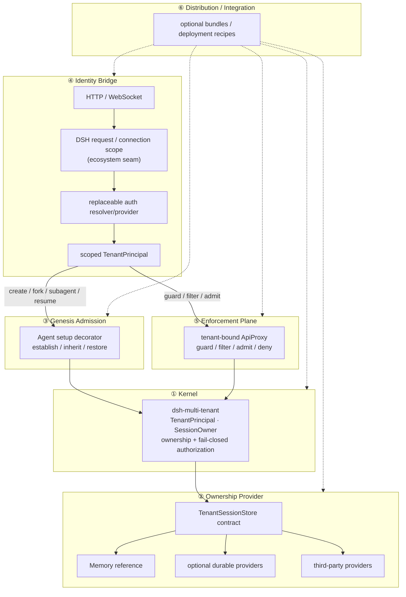

[简体中文](./architecture.zh-CN.md) | English

# Architecture — six layers, explicit ownership

The project is **one composable plugin family**, organized into six conceptual
layers. The layers describe where a multi-tenant guarantee must connect; they do
**not** mean this repository must implement every layer. The boundary rule is
part of the architecture:

- owned enforcement points are implemented and tested here;
- ecosystem-owned seams are specified and upstreamed;
- capabilities outside the supported threat model stay explicit boundaries.

## The six layers

| # | Layer | Artifact | Responsibility | Ownership / status |
| --- | --- | --- | --- | --- |
| ① | **Kernel** | `dsh-multi-tenant` | `TenantPrincipal` / `SessionOwner`, claim-once ownership, fail-closed authorization, the `TenantSessionStore` contract. | **Owned here.** ✅ test-pinned, prerelease contract. |
| ② | **Ownership provider** | `TenantSessionStore` impls | Persist ownership. Providers prove conformance with the shared contract suite. | **Contract owned here; providers replaceable.** ✅ in-memory reference; durable providers demand-gated. |
| ③ | **Genesis admission** | `ctx.agents` decorator | Join Agent `setup`; establish / inherit / restore ownership before `sessions.enter`. | **Owned here where DSH exposes the hook.** ✅ RC6 runtime proof; RC7 evidence refresh is release work. |
| ④ | **Identity bridge** | DSH transport scope + auth resolver/provider | Carry authenticated request/connection identity to a scoped `TenantPrincipal`. | **Split ownership.** 🤝 transport scope is a DSH ecosystem seam; auth providers are optional integrations after that seam exists. |
| ⑤ | **Enforcement plane** | `dsh-multi-tenant-web` | Principal-bound `ApiProxy`: guard/filter/admit/deny; later streams/respond under the same scope. | **Owned here after Layer ④ exists.** 🚧 unary spike exists; production Web contract is ecosystem-gated. |
| ⑥ | **Distribution / integration** | optional bundles / recipes | Compose whichever kernel, provider, auth, Web, MCP, audit, or deployment components a product needs. | **Not a mandatory full-stack deliverable.** 🧭 recipes may be added when useful. |

## Diagram



## Request flow

1. **④ Identity bridge** — a deployment authenticates an HTTP request or WS
   upgrade and resolves a `TenantPrincipal`. For production Web isolation this
   requires a DSH request/connection scope that can carry or install the scoped
   API/security context. The kernel never sees JWT/OIDC/API-key mechanics.
2. **③ Genesis** — on `create` / `fork` / `subagent` / `resume`, the admission
   decorator joins Agent `setup` and establishes, inherits, or restores ownership
   before `sessions.enter`.
3. **⑤ Enforcement** — a tenant-bound `ApiProxy` guards session-keyed methods,
   filters only collections whose semantics remain correct, and denies
   unmodelled/global surfaces. Streams/respond remain denied in the spike until
   Layer ④ provides a real principal scope.
4. **① Kernel** — `MultiTenantService` authorizes against the
   `TenantSessionStore` contract. Tenant and user ownership is immutable in the
   0.1 line.
5. **② Provider** — ownership is stored by the selected provider. Provider
   choice does not change the kernel contract.

## Dependency direction (one-way)

```text
Kernel primitives  ◀──  capability contracts  ◀──  providers / integrations
```

- The **kernel** has zero transport/vendor dependencies — it never knows JWT,
  PostgreSQL, HTTP, MCP, Redis, or a particular deployment runtime.
- Capability packages own only the contracts they can enforce.
- Provider and integration packages depend on the contract they implement; a
  sibling capability does not reach through another sibling's implementation.
- A missing upstream seam is not solved by importing or copying the entire
  upstream subsystem into the kernel.

## H3 under DSH RC7 — ecosystem seam, not kernel blocker

RC7's public `ConnectionRpcHandler` receives decoded
`(endpoint, payload, signal)`, while the DSH Web carrier owns the real HTTP/WS
boundary and documents that it currently has no authentication layer. That is
enough evidence to classify request/connection principal scope as an
**ecosystem-owned seam**.

The project therefore does not need a production-like local Web transport fork
to release the kernel. The deliverable is a minimal, tenant-agnostic upstream
proposal that lets a deployment derive/install a request/connection-scoped API
or security context from the real HTTP request / WS upgrade. When such a seam
exists, Layer ⑤ can turn its current fail-closed spike into production Web
enforcement.

## Explicit architecture boundary: execution isolation

This architecture protects the application/session control surfaces it covers.
It does **not** claim process, filesystem, shell, container, credential,
network/egress, or host isolation for an Agent that the surrounding DSH
deployment has already allowed to run. Strong execution isolation belongs to
the deployment/runtime layer and is intentionally outside this plugin family's
0.1 guarantee.

## Layer → roadmap ownership

| Layer | Roadmap treatment |
| --- | --- |
| ① Kernel | first-release blocker; owned and enforced here |
| ② Provider | contract is release blocker; durable providers are independent follow-ups |
| ③ Genesis admission | RC7 compatibility evidence is release blocker |
| ④ Identity bridge | ecosystem track; does not block kernel release |
| ⑤ Web enforcement | production work waits for Layer ④; not a kernel blocker |
| ⑥ Distribution / integration | optional recipes, never a required "complete SaaS stack" milestone |

See `../../ROADMAP.md` for the release and ecosystem tracks.