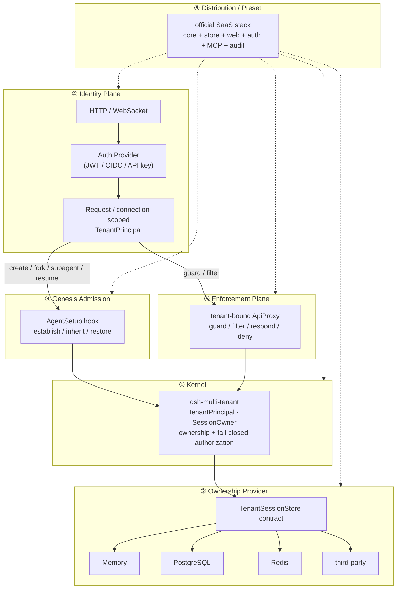

[简体中文](./architecture.zh-CN.md) | English

# Architecture — six layers

The project is **one composable plugin family**, organized into six layers. The
kernel owns only the cross-suite tenant primitives; every layer above it is a
replaceable capability, and every layer below the kernel is a swappable
provider. This document is the global map the individual ADRs and Seam Maps are
anchored to.

## The six layers

| # | Layer | Artifact | Responsibility | Status |
| --- | --- | --- | --- | --- |
| ① | **Kernel** | `dsh-multi-tenant` | `TenantPrincipal` / `SessionOwner`, claim-once ownership, fail-closed authorization, the `TenantSessionStore` contract. | ✅ test-pinned, prerelease contract |
| ② | **Ownership provider** | `TenantSessionStore` impls | Persist ownership (memory / PostgreSQL / Redis / MySQL / third-party). Proven by the shared contract suite. | ✅ seam + in-memory default; durable providers deferred |
| ③ | **Genesis admission** | `ctx.agents` decorator | Join every Agent `setup`; establish / inherit / restore ownership before `sessions.enter`. | 🚧 statically designed, runtime proof is M4 |
| ④ | **Identity plane** | transport + auth provider | Turn an authenticated HTTP/WS request into a request/connection-scoped `TenantPrincipal`. **H3 lives here.** | ⏳ the one upstream gap |
| ⑤ | **Enforcement plane** | `dsh-multi-tenant-web` | A tenant-bound `ApiProxy`: point guard, collection projection, respond guard, mux filter, host filter/deny. | 🚧 facade prototype only |
| ⑥ | **Distribution / preset** | the official SaaS stack | Compose core + store + web + auth + MCP + audit, each piece replaceable. | ⏳ |

## Diagram



## Request flow

1. **④ Identity** — an HTTP request or WS upgrade is authenticated; the auth
   provider (JWT / OIDC / API key) yields a `TenantPrincipal` bound to the
   request/connection scope. The kernel never sees the auth mechanism.
2. **③ Genesis** — on `create` / `fork` / `subagent` / `resume`, the admission
   decorator joins the Agent `setup` hook and establishes (create), inherits
   (fork / subagent), or restores (resume) ownership — all before
   `sessions.enter`, so there is no ownership window.
3. **⑤ Enforcement** — the tenant-bound `ApiProxy` guards point methods, filters
   collections and streams, and denies unclassifiable frames — fail-closed.
4. **① Kernel** — `MultiTenantService` authorizes against `TenantSessionStore`
   (claim-once, immutable, tenant boundary unconditional).
5. **② Provider** — ownership persists to memory / PostgreSQL / Redis / … behind
   the `TenantSessionStore` contract.

## Dependency direction (one-way)

```
Kernel primitives  ◀──  capability contracts  ◀──  providers
```

- The **kernel** has **zero** transport/vendor dependencies — it never knows
  JWT / PostgreSQL / HTTP / MCP / Redis. Enforced by `scripts/verify-packages.mjs`.
- **Capability** packages (③ genesis admission, ⑤ enforcement) own their own
  contracts and may depend on the kernel's primitives.
- **Providers** (②) depend on the contract they implement; sibling capabilities
  do not reach through each other's implementations.

## H3 is a hypothesis, not a conclusion

The static analysis (M2/M3) concludes the upstream proposal shrinks to **H3
only** — a request/connection-scoped principal seam. That is the current
*hypothesis*; the `ctx.agents` decorator (③) has not yet been runtime-proven to
join *every* `setup`. If M4 shows a decorator cannot reliably participate, then
admission composability (③) becomes a second upstream gap (an `AgentSetup`
contribution registry or agent-creation middleware). The upstream proposal is
written only after M4's real-runtime proof.

## Layer → doc map

| Layer | Docs |
| --- | --- |
| ① Kernel | `../README.md` core package, `./session-genesis-map.md` |
| ② Provider | `dsh-multi-tenant/testing` contract suite |
| ③ Genesis admission | `./session-genesis-map.md`, `./admission-composition.md`, `../adr/session-genesis.md` |
| ④ Identity plane | `../adr/web-enforcement.md` (H3) |
| ⑤ Enforcement | `./web-seam-map.md`, `../adr/web-enforcement.md` |
| ⑥ Preset | `../../ROADMAP.md` (M6/M7) |
