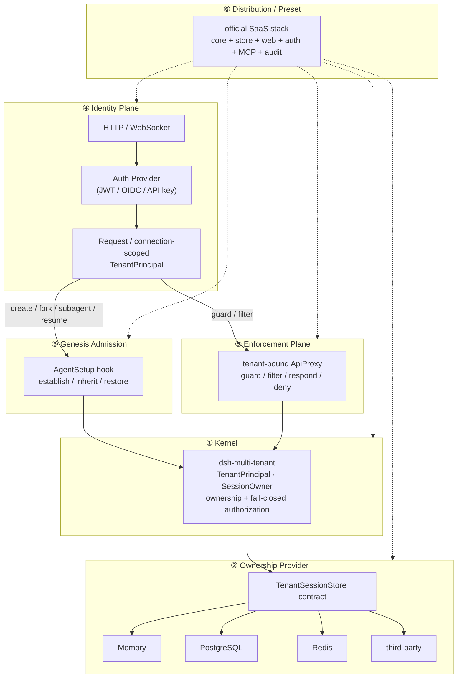

[English](./architecture.md) | 简体中文

# 架构 —— 六层

本项目是**一个可组合的插件家族**，组织为六层。内核只拥有跨套件的租户原语；其上每一层都是可替换的能力，其下每一层都是可替换的提供方。本文档是各 ADR 与 Seam Map 所锚定的全局图。

## 六层

| # | 层 | 产物 | 职责 | 状态 |
| --- | --- | --- | --- | --- |
| ① | **内核** | `dsh-multi-tenant` | `TenantPrincipal` / `SessionOwner`、一次性认领所有权、默认拒绝式授权、`TenantSessionStore` 契约。 | ✅ 已由测试锁定，契约预发布 |
| ② | **所有权提供方** | `TenantSessionStore` 实现 | 持久化所有权（内存 / PostgreSQL / Redis / MySQL / 第三方）。由共享契约套件证明。 | ✅ seam + 内存默认；持久提供方延后 |
| ③ | **创生准入** | `ctx.agents` 装饰器 | 加入每一次 Agent `setup`；在 `sessions.enter` 之前建立 / 继承 / 恢复所有权。 | 🚧 静态设计完成，运行时证明属 M4 |
| ④ | **身份平面** | transport + auth 提供方 | 把一次已认证的 HTTP/WS 请求变成 request/connection-scoped `TenantPrincipal`。**H3 在这里。** | ⏳ 唯一的上游缺口 |
| ⑤ | **强制平面** | `dsh-multi-tenant-web` | 租户绑定的 `ApiProxy`：point guard、collection 投影、respond guard、mux filter、host filter/deny。 | 🚧 仅 facade 原型 |
| ⑥ | **分发 / preset** | 官方 SaaS 栈 | 组合 core + store + web + auth + MCP + audit，每一块可替换。 | ⏳ |

## 图示



## 请求流

1. **④ 身份** —— 一次 HTTP 请求或 WS 升级被认证；auth 提供方（JWT / OIDC / API key）产出一个绑定到 request/connection 作用域的 `TenantPrincipal`。内核永远看不到认证机制。
2. **③ 创生** —— 在 `create` / `fork` / `subagent` / `resume` 上，准入装饰器加入 Agent `setup` 钩子，并建立（create）、继承（fork / subagent）、恢复（resume）所有权 —— 全部在 `sessions.enter` 之前，因此没有所有权窗口。
3. **⑤ 强制** —— 租户绑定的 `ApiProxy` 守卫 point 方法、过滤 collection 与流、并拒绝不可分类的 frame —— 默认拒绝。
4. **① 内核** —— `MultiTenantService` 对 `TenantSessionStore` 授权（一次性认领、不可变、租户边界无条件）。
5. **② 提供方** —— 所有权在 `TenantSessionStore` 契约之后持久化到内存 / PostgreSQL / Redis / …。

## 依赖方向（单向）

```
内核原语  ◀──  能力契约  ◀──  提供方
```

- **内核**有**零** transport/vendor 依赖 —— 它永远不感知 JWT / PostgreSQL / HTTP / MCP / Redis。由 `scripts/verify-packages.mjs` 强制。
- **能力**包（③ 创生准入、⑤ 强制）拥有自己的契约，且可以依赖内核原语。
- **提供方**（②）依赖其所实现的契约；兄弟能力不穿透彼此的实现。

## H3 是假设，不是结论

静态分析（M2/M3）得出上游提案收窄为**仅 H3** —— 一个 request/connection-scoped principal seam。这是当前的*假设*；`ctx.agents` 装饰器（③）尚未被运行时证明能加入*每一次* `setup`。若 M4 表明装饰器无法可靠参与，则准入组合性（③）会成为第二个上游缺口（一个 `AgentSetup` 贡献注册表或 agent 创建中间件）。上游提案要等 M4 的真实 runtime 证明之后才写。

## 层 → 文档对照

| 层 | 文档 |
| --- | --- |
| ① 内核 | `../README.md` 核心包、`./session-genesis-map.md` |
| ② 提供方 | `dsh-multi-tenant/testing` 契约套件 |
| ③ 创生准入 | `./session-genesis-map.md`、`./admission-composition.md`、`../adr/session-genesis.md` |
| ④ 身份平面 | `../adr/web-enforcement.md`（H3） |
| ⑤ 强制 | `./web-seam-map.md`、`../adr/web-enforcement.md` |
| ⑥ preset | `../../ROADMAP.md`（M6/M7） |
