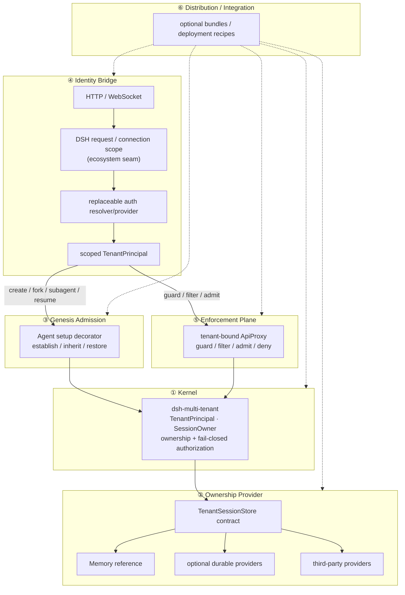

[English](./architecture.md) | 简体中文

# 架构 —— 六层，但明确归属

本项目是**一个可组合的插件家族**，概念上组织为六层。这些层说明多租户保证需要在哪些位置连接，并**不**意味着本仓库必须把每一层都自己实现。边界原则本身就是架构的一部分：

- 本仓库拥有的 enforcement point，由本仓库实现并测试；
- 属于生态的 seam，由本仓库定义标准并向上游协作；
- 超出支持 threat model 的能力，继续作为明确边界。

## 六层

| # | 层 | 产物 | 职责 | 归属 / 状态 |
| --- | --- | --- | --- | --- |
| ① | **内核** | `dsh-multi-tenant` | `TenantPrincipal` / `SessionOwner`、一次性认领所有权、默认拒绝式授权、`TenantSessionStore` 契约。 | **本仓库拥有。** ✅ 已由测试锁定，契约仍是 prerelease。 |
| ② | **所有权 provider** | `TenantSessionStore` 实现 | 持久化 ownership。Provider 通过共享 contract suite 证明一致性。 | **契约由本仓库拥有；provider 可替换。** ✅ 内存参考实现；durable provider 按需求触发。 |
| ③ | **创生准入** | `ctx.agents` decorator | 加入 Agent `setup`；在 `sessions.enter` 前建立 / 继承 / 恢复 ownership。 | **DSH 已暴露 hook 的地方由我们强制。** ✅ 有 RC6 runtime proof；RC7 evidence refresh 属于发布工作。 |
| ④ | **身份桥接** | DSH transport scope + auth resolver/provider | 把已认证 request/connection identity 传递成 scoped `TenantPrincipal`。 | **归属拆分。** 🤝 transport scope 是 DSH 生态 seam；auth provider 在 seam 存在后作为可选 integration。 |
| ⑤ | **强制平面** | `dsh-multi-tenant-web` | Principal-bound `ApiProxy`：guard/filter/admit/deny；未来在同一 scope 下处理 stream/respond。 | **Layer ④ 存在以后由我们拥有。** 🚧 unary spike 已有；production Web contract 受生态 seam 门控。 |
| ⑥ | **分发 / integration** | 可选 bundle / recipe | 根据产品需要组合 kernel、provider、auth、Web、MCP、audit 或 deployment 组件。 | **不是必须交付的完整全栈。** 🧭 有价值时再增加 recipe。 |

## 图示



## 请求流

1. **④ 身份桥接** —— deployment 对 HTTP request 或 WS upgrade 做认证，并解析出 `TenantPrincipal`。要实现 production Web isolation，需要 DSH 提供 request/connection scope，使 scoped API/security context 能在真实 transport 边界安装。Kernel 永远不知道 JWT/OIDC/API-key 的具体机制。
2. **③ 创生** —— 在 `create` / `fork` / `subagent` / `resume` 上，admission decorator 加入 Agent `setup`，并在 `sessions.enter` 之前建立、继承或恢复 ownership。
3. **⑤ 强制** —— tenant-bound `ApiProxy` 守卫 session-keyed method，只过滤 post-filter 后语义仍正确的 collection，并拒绝未建模/global surface。Layer ④ 提供真实 principal scope 之前，spike 中的 stream/respond 继续默认拒绝。
4. **① 内核** —— `MultiTenantService` 通过 `TenantSessionStore` contract 做授权。0.1 版本线保持 tenant+user ownership 不可变。
5. **② Provider** —— ownership 由选定 provider 存储。Provider 选择不会改变 kernel contract。

## 依赖方向（单向）

```text
内核原语  ◀──  能力契约  ◀──  provider / integration
```

- **内核**没有 transport/vendor 依赖 —— 不感知 JWT、PostgreSQL、HTTP、MCP、Redis 或具体 deployment runtime。
- capability package 只拥有它真正能强制的 contract。
- provider / integration package 依赖自己实现的 contract；兄弟能力不穿透彼此实现。
- 缺少 upstream seam 时，不通过把整个 upstream subsystem 导入或复制进 kernel 来“解决”。

## DSH RC7 下的 H3 —— 生态 seam，不是 kernel 发布阻塞项

RC7 公开的 `ConnectionRpcHandler` 接收解码后的
`(endpoint, payload, signal)`；真实 HTTP/WS boundary 由 DSH Web carrier 自己持有，而且官方文档明确说明目前没有 authentication layer。这些证据已经足够把 request/connection principal scope 归类为**生态拥有的 seam**。

因此，发布 kernel 不需要先做一套 production-like 的本地 Web transport fork。本项目应该交付一个最小、tenant-agnostic 的 upstream proposal，让 deployment 可以基于真实 HTTP request / WS upgrade 建立或安装 request/connection-scoped API/security context。这个 seam 存在以后，Layer ⑤ 才把当前 fail-closed spike 变成 production Web enforcement。

## 明确架构边界：执行隔离

本架构保护的是它实际覆盖的 application/session control surface。对于 surrounding DSH deployment 已经允许执行的 Agent，本项目**不**声称提供 process、filesystem、shell、container、credential、network/egress 或 host isolation。强执行隔离属于 deployment/runtime 层，并明确不在本插件家族 0.1 guarantee 中。

## Layer → Roadmap 归属

| Layer | Roadmap 处理方式 |
| --- | --- |
| ① Kernel | 第一次发布阻塞项；本仓库拥有并强制 |
| ② Provider | contract 阻塞发布；durable provider 是独立 follow-up |
| ③ Genesis admission | RC7 compatibility evidence 阻塞发布 |
| ④ Identity bridge | ecosystem track；不阻塞 kernel release |
| ⑤ Web enforcement | production 工作等待 Layer ④；不阻塞 kernel |
| ⑥ Distribution / integration | 可选 recipe，不再是“完整 SaaS 栈”必做 milestone |

发布主线与生态主线见 `../../ROADMAP.md`。